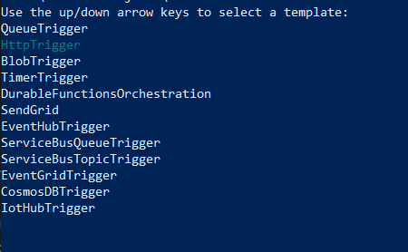
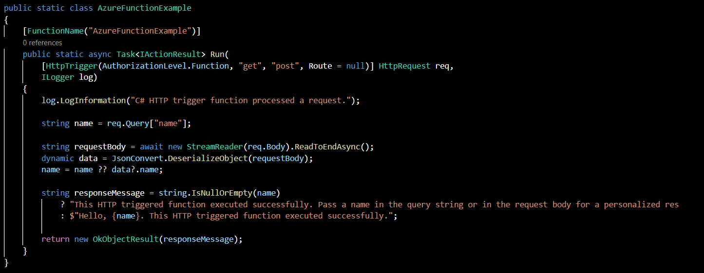
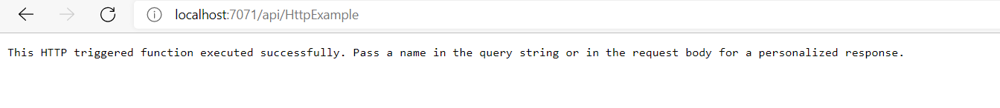
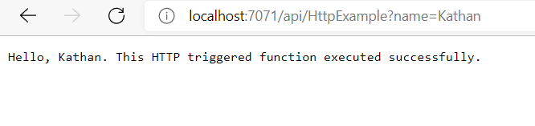

# Dockerize Azure Functions

This document is used to collect information on dockerizing Azure functions and create the ability to run Azure function locally by decopuling cloud based dependencies.

## Introduction

First we need the following prerequisites installed to dockerize an Azure function:

1. [Docker Desktop](https://docs.docker.com/get-docker/)
2. [Docker Compose](https://docs.docker.com/compose/install/)
3. [Azure Storage Explorer](https://docs.microsoft.com/en-us/azure/vs-azure-tools-storage-manage-with-storage-explorer?tabs=windows)(Only needed if emulating blob or queue storage)
4. [Azure Functions core tools](https://github.com/Azure/azure-functions-core-tools)

## Dockerfile

There are many ways to create an initial docker file. You can create a local function project using this command which generates a Dockerfile inside the project directory

```sh 
func init <ProjectName> --dotnet --docker
```

If you want to try out different worker runtimes you can also run 
```sh
func init --docker
```
This will give you an option to select between dotnet, node and python.

The Dockerfile should look something like this:
```Dockerfile
FROM mcr.microsoft.com/dotnet/core/sdk:3.1 AS installer-env

# Copy .env variables through to Azure Function container
ENV AzureWebJobsStorage=$AzureWebJobsStorage
ENV env = $env

COPY . /src

RUN cd /src && \
    mkdir -p /home/site/wwwroot && \
    dotnet publish *.csproj --output /home/site/wwwroot

# To enable ssh & remote debugging on app service change the base image to the one below
# FROM mcr.microsoft.com/azure-functions/dotnet:3.0-appservice
FROM mcr.microsoft.com/azure-functions/dotnet:3.0
ENV AzureWebJobsScriptRoot=/home/site/wwwroot \
    AzureFunctionsJobHost__Logging__Console__IsEnabled=true

COPY --from=installer-env ["/home/site/wwwroot", "/home/site/wwwroot"]
```

## Docker Compose

You can build and run containers and images without a Docker Compose file but having one makes it easier to manage multiple containers and test different ports. Create a file called docker-compose.yml and paste the following:

```docker-compose
version: '3'
services:

    storage.docker.emulator:
        image: "mcr.microsoft.com/azure-storage/azurite:3.14.0"
        container_name: storage.docker.emulator
        ports:
            - 10001:10001
            - 10002:10002

    local.functions:
        container_name: local.functions
        build:
            context: .
            dockerfile: Dockerfile
        ports:
            - 7071:80
        environment:
            # Copy .env variables through to container
            - AzureWebJobsStorage

        depends_on:
            - storage.docker.emulator
```
NOTE: The latest azurite image is not compatible hence we are using 3.14.0

## Create an Azure Function

After Docker and Docker compose files are setup you can create a new Azure function by running the following command
```sh
func new
```


This command will give multiple options to select a template function. For this example choose option 2 "HttpTrigger" and then enter the function name (HttpExample). Take a look at what the template looks like. In a file called HttpExample.cs you will see an Azure function with Http trigger similar to the function below.



To run the functions from within a container we need to change the Authorization level in this file. Change AuthorizationLevel.Function to AuthorizationLevel.Anonymous

## Running functions locally

Once your Dockerfile and Docker compose files are properly set up, it is time to test the functions.

Run the following command:
```sh
docker-compose up
```

This command will build and run docker containers setup in Dockerfile.
Note: If you made any code changes within the function, run the following command to reflect the changes and build a NEW image. 

```sh
docker-compose up --build
```

To test the function paste the following URL in a browser or postman: 

```sh
http://localhost:7071/api/HttpExample
```



OR

```sh
http://localhost:7071/api/HttpExample?name=Kathan
```


You can change the port number from within docker compose as needed.

To stop the containers press ctrl+C and run the following command
docker-compose down


