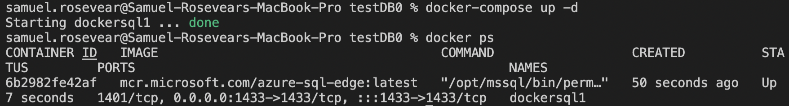

# Setting up a containerized SQL DB Image using docker-compose:

We can quickly create and run a SQL container image using a docker-compose.yml file. Below is a template of such a file:

## docker-compose.yml template:
```
version: "3.7"
services:
  sql-server-db:
    container_name: exampleSql
    image: mcr.microsoft.com/mssql/server:2019-latest
    ports: 
      - "1433:1433"
    environment: 
      SA_PASSWORD: "StrongPassword$"
      ACCEPT_EULA: "Y"
```

- NOTICE: M1 Mac users will need to change their image to the following line:
```
image: mcr.microsoft.com/azure-sql-edge:latest
```

Now let's check to make sure our container is created. Run the following command in terminal:

```
docker-compose ps
```

The output should look like this:


We see our container has been created. Now we can start it. Run the following in terminal:

```
docker-compose up -d
```

The output should tell us that our container has started.

Now when we run "docker-compose ps" again, it should reveal the status of the container, as well as other information:



(note that I am using the azure-sql-edge image becuase I am operating on an M1 Mac)

### Confirm that the container is running in Docker Desktop:

A green container means our SQL DB image is running, and we are ready to connect to it. There is also a handy button that allows you to open the docker-compose file in VS Code:


## Now we are ready to connect.

More information on containerized DB images:

Link to docker hub page for MSSQL image:
https://hub.docker.com/_/microsoft-mssql-server

Link to docker hub page for Azure SQL Edge image:
https://hub.docker.com/_/microsoft-azure-sql-edge