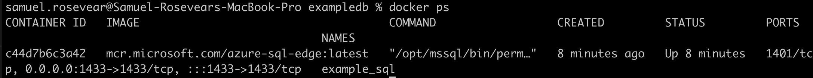

# Setting up a Containerized SQL DB with Docker on an M1 Mac

The Apple M1 chip unfortunately doesn't support the ARM architecture necessary to run the latest version of containerized mssql. Therefore, M1 Mac users will need to create an Azure SQL Edge container.

Link to the Docker Hub page about the Azure SQL Edge container image:

https://hub.docker.com/_/microsoft-azure-sql-edge

### Required: 
- [Docker Desktop](https://docs.docker.com/get-docker/)
- [Docker Compose](https://docs.docker.com/compose/install/)
- Azure Data Studio (or another DB manager)

## Getting started:

Run the following script in a terminal window:
```
docker run --name example_sql -e 'ACCEPT_EULA=Y' -e 'SA_PASSWORD=StrongPassword$' -p 1433:1433 -d mcr.microsoft.com/azure-sql-edge:latest
```
- Be sure to rename your mssql database container to something you will recognize, instead of "db_container_name"
- Change your password to something strong and unique
- Make sure you have the information for your containerized database written down prior to running so that you can remember it when connecting

### Check that the container has started:

- In terminal run the following command
```
docker ps
```
- Check that the information displaying is correct. It should look something like this:



- Now check Docker Desktop to confirm that your container has started. A running container will be green like so:


Notice how the mssql container is not running, as it is not supported on M1 Mac. It will automatically exit.

### Connect to your database:

- Now that we have created the Azure SQL Edge DB container, let's connect to it. In Azure Data Studio, create a new query with the information with which we created our container:


- Be sure to use server 127.0.0.1 as seen above.

- Now Azure Data Studio should look like this, set up for you query.


### Create a new test database:

- Hit the new query button, and run the following code:

```
USE master
GO
IF NOT EXISTS (SELECT [name]
FROM sys.databases
WHERE [name] = N'TestDb')
CREATE DATABASE TestDb
GO
```

There should be a new "TestDb" database under databases for your connection.
